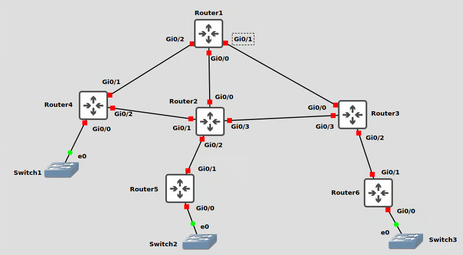

# Build

In GNS3, open a new project and save it as **RIPv2**. 

Build as shown, start your devices and open terminal windows to each.

<figure><figcaption></figcaption></figure>

I will use subnets 192.168.3.0/24 and 192.168.4.0/24, also VPCS 3 and 4 as shown. Which routers you link to which interface is not important but tabulate it! For simplicity, I use a /24 for every link. I a real design, I’d use a /30.

I configure as shown.

```
hostname Router1

int gi0/0
 description LAN
 ip address 192.168.1.1 255.255.255.0
 no shut
 exit

int gi0/1
 description Router2
 ip address 192.168.101.1 255.255.255.0
 no shut
 exit

int gi0/2
 description Router3
 ip address 192.168.102.1 255.255.255.0
 no shut
 exit
 
 int gi0/3
 description Router4
 ip address 192.168.103.1 255.255.255.0
 no shut
 exit
```

```
hostname Router2

int gi0/0
 description LAN2
 ip address 192.168.2.2 255.255.255.0
 no shut
 exit

int gi0/1
 description Router1
 ip address 192.168.101.2 255.255.255.0
 no shut
 exit

int gi0/2
 description Router4
 ip address 192.168.104.2 255.255.255.0
 no shut
 exit
 
int gi0/3
 description Router3
 ip address 192.168.105.2 255.255.255.0
 no shut
 exit

```

```
hostname Router3

int gi0/0
 description LAN3
 ip address 192.168.3.3 255.255.255.0
 no shut
 exit

int gi0/1
 description Router4
 ip address 192.168.106.3 255.255.255.0
 no shut
 exit

int gi0/2
 description Router1
 ip address 192.168.102.3 255.255.255.0
 no shut
 exit
 
 int gi0/3
 description Router2
 ip address 192.168.105.3 255.255.255.0
 no shut
 exit

```

```
hostname Router4

int gi0/0
 description LAN4
 ip address 192.168.4.4 255.255.255.0
 no shut
 exit

int gi0/1
 description Router3
 ip address 192.168.106.4 255.255.255.0
 no shut
 exit

int gi0/2
 description Router2
 ip address 192.168.104.4 255.255.255.0
 no shut
 exit
 
 int gi0/3
 description Router1
 ip address 192.168.103.4 255.255.255.0
 no shut
 exit

```

Each router should be able to ping three remote routers, test that this is the case.

Also configure the four VPCS. For VPCS1

```
ip 192.168.1.101/24 gateway 192.168.1.1
```

For VPCS2

```
ip 192.168.2.101/24 gateway 192.168.2.2
```

For VPCS3

```
ip 192.168.3.101/24 gateway 192.168.3.3
```

For VPCS4

```
ip 192.168.4.101/24 gateway 192.168.4.4
```
