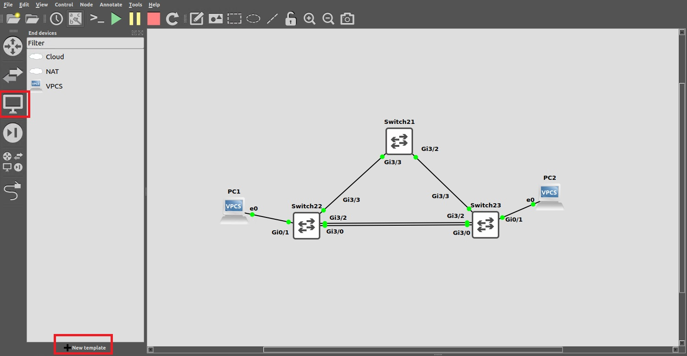

# Network Automation Container

In GNS3, I select **End Devices** and then click **+New Template**

<figure><figcaption></figcaption></figure>

Select to **Install an appliance from the GNS3 server** and click **Next**

<figure><figcaption></figcaption></figure>

Select **Guests** and then **Network Automation, Install,** and then **Install the appliance on your computer** and **Finish.**

<figure><figcaption></figcaption></figure>

The first time you pull a Network Automation container into your project, it will download the Docker files. You need a decent Internet connection for this.
