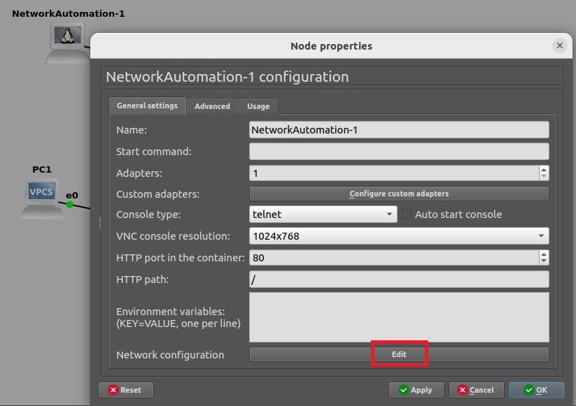

# Wiring up

On each switch, we had configured gi0/1 in the NetMan VLAN. Verify this is the case on Switch21.

<figure><figcaption></figcaption></figure>

Connect the Network Automation container to this port.

Right-click the Network Automation device and **Configure**. Then click to **Edit** the network configuration.

<figure><figcaption></figcaption></figure>

I edit and uncomment so my Network Automation device is 192.168.10.103.

<figure><figcaption></figcaption></figure>

I Save and Apply. Then I stop and start the Network Automation device. Then I verify if I have the correct address.

<figure><figcaption></figcaption></figure>

Finally, do a ping test to the other network devices.
